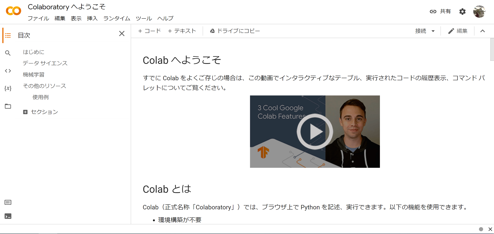
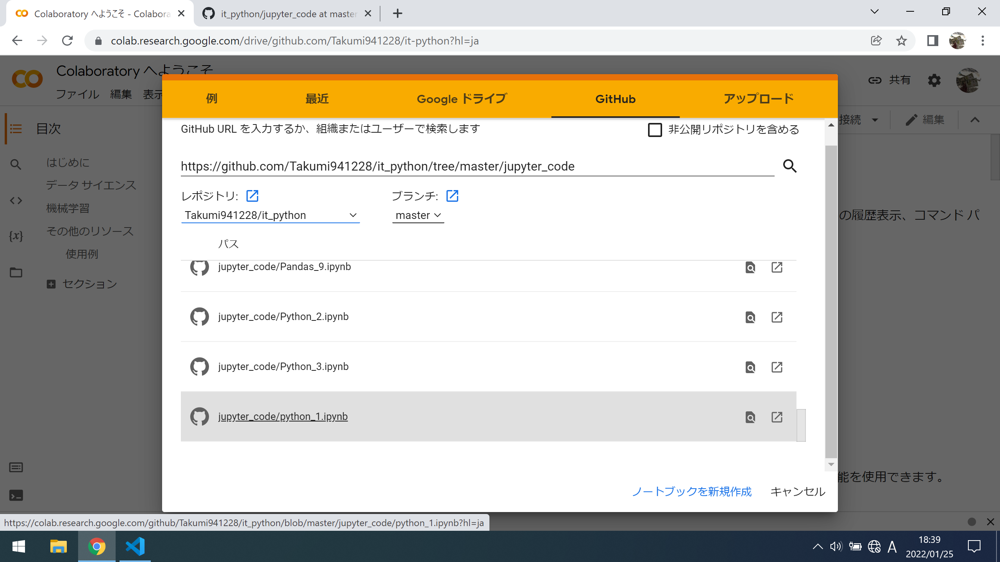

# プログラミング入門

## 基本セット

IDE, ESP32-DevKit-C等の環境構築を行います.

### 利用ハードおよびサービス

* ESP32-DevKitC-32E

    * https://akizukidenshi.com/catalog/g/gM-15673/

* Google Colaboratory

    * https://colab.research.google.com/notebooks/welcome.ipynb?hl=ja

### Colaboratoryのセットアップ

今回の演習では,Colaboratoryを利用します.

## Colaboratoryとは

Google Colaboratory（グーグル・コラボラトリ）とは,Google社が機械学習の教育及び研究用に提供しているインストール不要かつ,すぐにPythonや機械学習・深層学習の環境を整えることが出来る無料のサービスです.Colab（コラボ）とも呼ばれます.無料で利用する事が出来ますが,Googleアカウントが必要になります.

Colaboratoryでは,Python等をWeb上で記述および実行できる統合開発環境であるJupyter Notebookが採用されており,Googleアカウントだけで利用できるサービスとなっています.

## Jupyter Notebookとは

Jupyter Notebookとは,機械学習などのデータ分析に使用されることを想定されており, データの可視化などの作業に適しています.対話型の開発環境であるため,前の実行結果に応じて,次に実行するプログラムや作業を選択することができます.

# 開発環境の準備

今回の演習では,事前に用意してあるサンプルコードを開きながら実施する,そのための設定等を行います.

## Colaboratoryの利用開始

Colaboratoryを利用開始するためには,Webページへログインします.ブラウザで'https://www.google.com/intl/ja/account/about/' と入力し,Googleアカウントでログインします.

## ノートブックを開く

既存のノートブックを開きます.「ファイル」-「ノートブックを開く」をクリックします.

上記タブにある,"GitHub"をクリックします.検索欄に'https://github.com/Takumi941228/it_python/tree/master/jupyter_code' と入力し,"jupyter_code/python_1.ipynd"を開きます.

## セルの実行