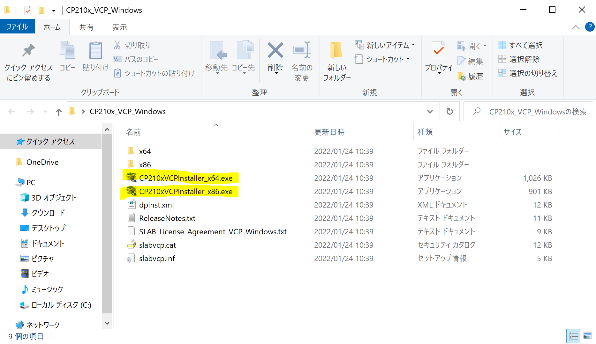

# プログラミング入門

## IDE（統合開発環境）

Visual Studio Codeのセットアップ. 下記アドレスからソフトウェアをダウンロード, インストールを行います．

* Visual Studio Code
    * https://code.visualstudio.com/download

## ESP32-DevKit-Cの環境構築

VSCodeでESP32を利用するための環境構築を行います.

### USBドライバのインストール

Silicon Labs CP210x driverを使用するOSから以下のアドレスよりダウンロードしてインストールします.

- [Windows](https://www.silabs.com/documents/public/software/CP210x_VCP_Windows.zip)
- [macOS](https://www.silabs.com/documents/public/software/Mac_OSX_VCP_Driver.zip)
- [Linux](https://m5stack.oss-cn-shenzhen.aliyuncs.com/resource/drivers/CP210x_VCP_Linux.zip)

## Visual Studio Codeセットアップ

### Pythonのインストール

Pythonを以下のアドレスよりダウウンロードしてインストールします.